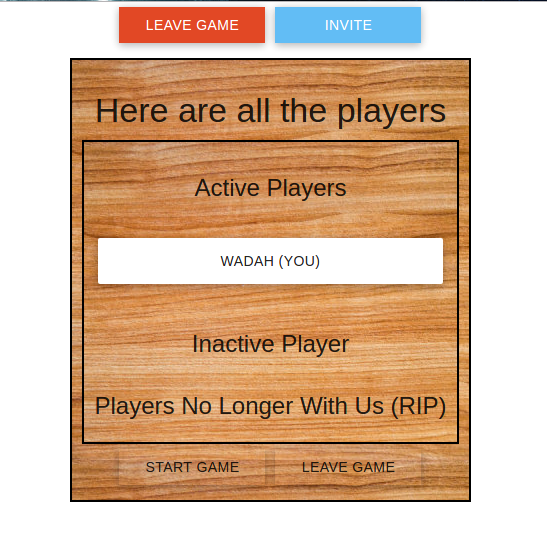
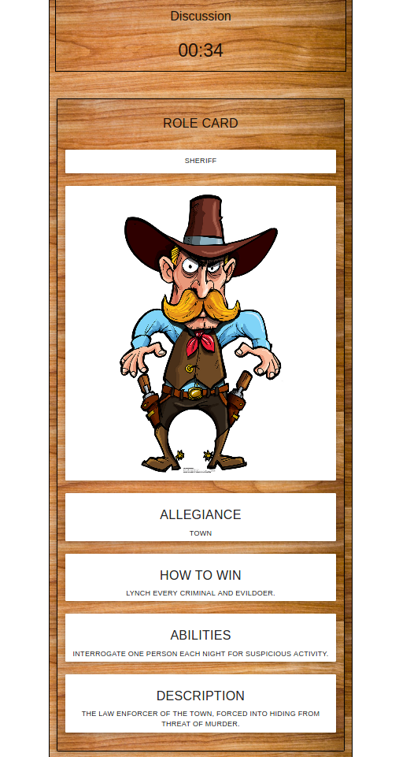

# a/A Mafia

Inspired by the popular party game Mafia/Werewolves, as well as Town of Salem, a/A Mafia seeks to address a fundamental problem with starting a game: Who carries decks of cards, thats not also a day-time magician??

a/A Mafia bridges the gap between mafia and ToS by operating on a device everyone has now, their cell-phones.

## Getting Started

Once the game has started, players are challenged on their ability to convincingly lie as well as detect when other players are lying. The game is played live, and can range from 7 to 15 players. Upon entering a game, players will randomly assigned to groups - Town, Mafia, and Neutrals.

<p align='center'>Lobby</p>
<div align='center'>

</div>


<p align='center'>Player Card</p>

<div align='center' height='500px'>

</div>


## Alignments

### If you are a member of the Mafia (the bad guys/ but way more fun)
You've got to secretly kill off all those who aren't mafia. No worries about a friendly fire, and you'll be aware of your accomplices from the start. Armed with this knowledge, you need to conspire and deflect any suspicion to from your collaborators to others

### If you are a Town member (the good guys)
Your job is to track down all members of the Mafia and other villains before they get a chance to kill you. The catch? You don't know who is a Town member and who is a villain.

### Other Roles, (ie Serial Killer)

Your Goals will be labeled in your player cards


### Prerequisites

This game utilizes Firebase to maintain a unified live server, so an internet connection is need.

```
const userRef = (location, uid) =>
	app.database().ref("/gamerooms/" + location + "/players/" + uid);
```
Using a unique game ID, all players stemming from the same invite, will take part in the same game

```
signIn() {
  app.auth().onAuthStateChanged(user => {
    if (user) {
      this.setState({
        uid: user.uid
      });
    } else {
      app
        .auth()
        .signInAnonymously()
        .then(() => this.signIn());
    }
  });
}
```
The game utilizes an anonymous login, courtesy of firebase, which will allow players to have a unique ID, reconnects, and custom player names

### Installing

If a live link isn't provide, feel free to clone this repo, and run the following commands to run the game on a local server

```
npm install
npm start
```
End with an example of getting some data out of the system or using it for a little demo


## Built With

* [React](https://reactjs.org/) - FrontEnd Framework
* [Firebase](firebase.google.com) - Simple a BackEnd server
* [React-Router](https://github.com/ReactTraining/react-router) - Dynamic Routing
* [React Notifications](https://www.npmjs.com/package/react-notifications) - Clean and Simple Notifications Manager

## Acknowledgments

* Shout Out to Dmitry Davidoff for creating this awesome party game
* Equal Shout Outs to BlankMediaGame and it's community for fleshing out the idea, making it wayyyyy more fun to play
* God
* Kanye
